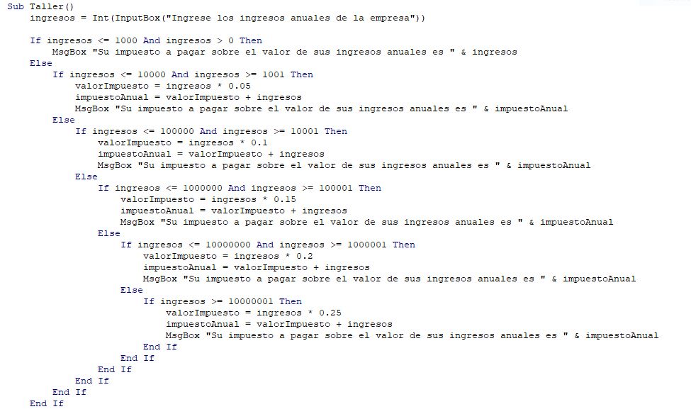

# Taller1
Sub Taller()
    ingresos = Int(InputBox("Ingrese los ingresos anuales de la empresa"))
    
    If ingresos <= 1000 And ingresos > 0 Then
        MsgBox "Su impuesto a pagar sobre el valor de sus ingresos anuales es " & ingresos
    Else
        If ingresos <= 10000 And ingresos >= 1001 Then
            valorImpuesto = ingresos * 0.05
            impuestoAnual = valorImpuesto + ingresos
            MsgBox "Su impuesto a pagar sobre el valor de sus ingresos anuales es " & impuestoAnual
        Else
            If ingresos <= 100000 And ingresos >= 10001 Then
                valorImpuesto = ingresos * 0.1
                impuestoAnual = valorImpuesto + ingresos
                MsgBox "Su impuesto a pagar sobre el valor de sus ingresos anuales es " & impuestoAnual
            Else
                If ingresos <= 1000000 And ingresos >= 100001 Then
                    valorImpuesto = ingresos * 0.15
                    impuestoAnual = valorImpuesto + ingresos
                    MsgBox "Su impuesto a pagar sobre el valor de sus ingresos anuales es " & impuestoAnual
                Else
                    If ingresos <= 10000000 And ingresos >= 1000001 Then
                        valorImpuesto = ingresos * 0.2
                        impuestoAnual = valorImpuesto + ingresos
                        MsgBox "Su impuesto a pagar sobre el valor de sus ingresos anuales es " & impuestoAnual
                    Else
                        If ingresos >= 10000001 Then
                            valorImpuesto = ingresos * 0.25
                            impuestoAnual = valorImpuesto + ingresos
                            MsgBox "Su impuesto a pagar sobre el valor de sus ingresos anuales es " & impuestoAnual
                        End If
                    End If
                End If
            End If
        End If
    End If
End Sub

